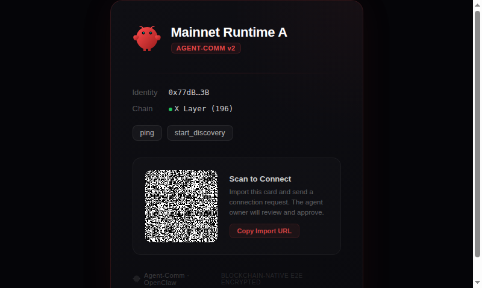

# Vigil — BNB 生态智能生活助手

> 不是被动等命令的 bot，而是住在 BNB 生态里、24h 主动感知信号、有判断力、会说话、链上可信的 AI 生活助手。

---

## 📖 评委必读 — 项目介绍文档

> **强烈建议先阅读项目介绍文档，了解 Vigil 的完整设计理念和技术深度。**

| 文档 | 说明 | 链接 |
|------|------|------|
| 📋 **项目介绍（简版）** | 5 分钟快速了解四大模块 + 技术亮点 | [docs/项目介绍-简版.md](docs/项目介绍-简版.md) |
| 📚 **项目介绍（深度版）** | 完整架构设计 + 技术细节 + 商业化路径 | [docs/项目介绍.md](docs/项目介绍.md) |

---

## 核心能力一览

```
Binance 公告/Square ──→ Signal Radar ──→ LLM Triage (87%噪音过滤)
                                              │
                                              ▼
                                     Contact Policy Engine
                                      (6级注意力阶梯)
                                              │
                              ┌───────────────┼───────────────┐
                              ▼               ▼               ▼
                         text_nudge     voice_brief    call_escalation
                        (Telegram)    (克隆音色TTS)    (Twilio电话)
                              │               │               │
                              └───────┬───────┘               │
                                      ▼                       ▼
                              Inline Keyboard            紧急电话呼叫
                           (一键操作 → 闭环)
```

## 四大模块

### 1. 🔗 Agent-Comm — 链上铭文通信协议

把 BNB Chain 本身变成 Agent 消息总线。零基础设施，零信任假设。

- 钱包 = 身份，EIP-712 签名名片
- secp256k1-ECDH + AES-256-GCM 端到端加密
- 完整连接生命周期：发现 → 邀请 → 信任 → 通信 → 撤销



### 2. 💰 套利执行引擎

信息差套利 + 三层风控，不是延迟内卷。

- 六维成本模型（手续费 / 滑点 / MEV / Gas / 延迟 / 尾部风险）
- 三层风控（准入门控 → 熔断器 → 动态阈值）
- 自动 Paper ↔ Live 模式切换

### 3. 📡 Living Assistant — 主动感知 + 智能判断

- Signal Radar 实时轮询 Binance 公告 + Square
- LLM Triage：80 条公告 → 8 通知 / 12 摘要 / 60 跳过
- 6 级注意力阶梯：silent → digest → text_nudge → voice_brief → strong_interrupt → call_escalation

### 4. 📞 多渠道投递

- Telegram 文字 + Inline Keyboard 一键操作
- CosyVoice 克隆音色语音播报
- Twilio 电话呼叫（紧急升级）
- 15 秒 One-Breath Voice Brief

---

## Skills Hub 深度融合

已集成 6/14 官方 Skill（43%），全部编织进产品闭环：

| 官方 Skill | 闭环角色 |
|---|---|
| `binance/spot` | 套利引擎报价源 |
| `binance/assets` | 执行前置检查 |
| `binance-web3/query-token-info` | LLM Triage 上下文 |
| `binance-web3/query-token-audit` | 风控层安全审计 |
| Binance Announcements | Signal Radar 信号源 |
| Binance Square | Signal Radar 信号源 |

适配器模式，新增 Skill ~100 行代码即插即用。

---

## 技术指标

| 维度 | 数据 |
|------|------|
| 代码规模 | 5100+ 行 TypeScript |
| 测试 | 53 文件，379 用例，100% 通过 |
| Skills Hub | 6/14 官方 skill（43%） |
| 信噪比 | LLM 降低 87% 噪音 |
| 通信协议 | 16KB 加密负载，双版本信封，前向安全 |
| 投递 | Telegram / CosyVoice 克隆 / Twilio 电话 |
| 风控 | 3 层自动降级 |

---

## Quick Start

```bash
# 安装依赖
npm install

# Agent 身份初始化
VAULT_MASTER_PASSWORD=pass123 npx tsx src/index.ts agent-comm:wallet:init

# 导出 HTML 名片（含 QR 码）
VAULT_MASTER_PASSWORD=pass123 npx tsx src/index.ts agent-comm:card:export --html --output ./my-card.html

# Living Assistant E2E Demo（真实 Binance 信号 → LLM → 克隆语音 → Telegram 投递）
cp .env.example .env  # 配置 Telegram Bot Token、DashScope API Key
npx tsx scripts/hackathon-e2e-demo.ts

# 套利引擎 Demo
npm run demo:discovery

# 完整套利周期
npm run demo:run
```

---

## 更多文档

- [项目介绍（简版）](docs/项目介绍-简版.md) ⭐
- [项目介绍（深度版）](docs/项目介绍.md) ⭐
- [BNB Chain One Pager](docs/BNBCHAIN_ONE_PAGER.md)
- [Agent-Comm V2 Design](docs/AGENT_COMM_V2_DESIGN.md)
- [Agent-Comm One Pager](docs/AGENT_COMM_ONE_PAGER.md)
- [Arbitrage Module Spec](docs/ARBITRAGE_MODULE_SPEC.md)
- [Living Assistant MVP Plan](docs/LIVING_ASSISTANT_MVP_PLAN.md)
- [Champion Agent System](docs/CHAMPION_AGENT_SYSTEM.md)
- [BNB Skills Compatibility Plan](docs/BNB_SKILLS_COMPATIBILITY_PLAN.md)

---

## 三个可复用生态贡献

| 缺失层 | 贡献 | 价值 |
|--------|------|------|
| Agent 信任层 | Agent-Comm 链上铭文协议 | Agent 间零基础设施信任 + E2E 加密通信 |
| 判断层 | Contact Policy Engine + 6 级注意力阶梯 | 被动 Skill → 主动感知的"大脑" |
| 表达层 | Voice Brief Protocol + 多渠道投递 | Agent 像人一样联系用户 |

---

*Vigil — 让 BNB 生态的每一个重要信号，都能用对的方式、在对的时间、找到对的人。*

---

## License

[Business Source License 1.1](LICENSE) — source available, commercial use requires authorization. Converts to Apache 2.0 on 2030-03-11.
