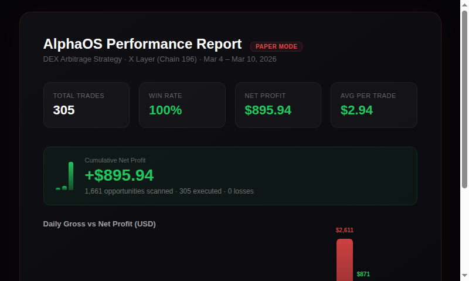

# AlphaOS (Skill-Oriented Architecture)

AlphaOS is implemented as a reusable skill runtime, not a loose set of services.

## Performance

Paper trading results on X Layer (Chain 196), March 4–10, 2026:

- **305 trades** executed, **100% win rate**, **$895.94 net profit**
- 1,661 opportunities scanned across DEX pairs
- Peak day: Mar 10 — 294 trades, $870.77 net profit



## Product Highlights

Beyond the core arbitrage engine and Agent-Comm protocol, AlphaOS ships a set of product-level touches designed for real-world operator experience and organic distribution.

**Shareable Identity (Agent-Comm)**

- Export a self-contained HTML contact card with embedded QR code — works offline, hostable anywhere, no external dependencies.
- Consent-gated connections: importing a card does not auto-trust. The peer requests a connection; the owner approves or rejects. Safe to share publicly.


```bash
# Generate a shareable HTML card
VAULT_MASTER_PASSWORD=pass123 npm run dev -- agent-comm:card:export --html --output ./my-card.html
```

**Growth & Distribution Engine**

- `/api/v1/growth/moments` — auto-generated shareable content: daily summaries, best trades, win streaks, risk events. Ready for social distribution.
- `/api/v1/growth/share/latest` — one-call battle report export for community sharing.
- `/api/v1/stream/metrics` — SSE real-time stream of opportunities, trades, PnL, and mode changes. Plug into any dashboard or terminal UI.

**Observability & Reproducibility**

- `/api/v1/backtest/snapshot` — export historical data as JSON or CSV for offline analysis.
- `/api/v1/replay/sandbox` — replay past trades under different parameters to validate strategy changes.
- `/api/v1/integration/onchainos/probe` — one-click health check of the full OnchainOS v6 execution path (quote → swap → simulate → broadcast). Reports readiness level: `ready` / `degraded` / `unavailable`.

**Live Demo Page**

- `GET /demo` — a built-in browser page that streams live metrics, growth moments, and OnchainOS probe status in real time. No frontend build step required.

**Webhook Bridge (Optional)**

- Fire-and-forget notification on every successfully processed inbound Agent-Comm message. Wake OpenClaw, trigger a workflow, or feed any webhook-compatible system.

**One-Click Demo Scripts**

```bash
npm run demo:run            # Full arbitrage cycle demo → demo-output/
npm run demo:discovery      # Discovery engine demo → demo-output/
npm run demo:smoke:live     # Live OnchainOS integration smoke test
```

## Layout
- `skills/alphaos/SKILL.md`: reusable skill contract and workflow
- `src/skills/alphaos/`: runtime implementation for this skill
  - `engine/`: multi-strategy orchestration and mode gates
  - `plugins/`: strategy plugins (`dex-arbitrage`)
  - `runtime/`: DB, vault, market adapter, notifier, risk, simulator, agent-comm
  - `api/`: demo/control endpoints

## Core flow
`scan -> evaluate -> plan -> simulate -> execute -> record -> notify`

## Algorithm Notes
- `docs/ALGORITHM.md`: 中文算法说明（盈利原理、风险点、公式、门控与熔断）
- `docs/ALPHAOS_OPERATIONS.md`: Operator runbook — configuration, startup, observation, tuning, data export
- `docs/JUDGE_ONE_PAGER.md`: 一页说明（面向评审）
- `docs/OPENCLAW_DISCOVERY_PLAYBOOK.md`: OpenClaw 双向编排接入手册（start/report/approve/hook）

## Quick Start

### 方式一：X Layer 推荐路径（新手推荐）

```bash
cp .env.example .env
# 编辑 .env，设置 NETWORK_PROFILE_ID=xlayer-recommended（默认）
# 只需填写 OnchainOS 凭证，其他配置会自动使用推荐默认值
npm install
npm run dev
```

### 方式二：自定义 EVM 链

```bash
cp .env.example .env
# 编辑 .env，设置 NETWORK_PROFILE_ID=evm-custom
# 必须显式指定：ONCHAINOS_CHAIN_INDEX, COMM_CHAIN_ID, COMM_RPC_URL
npm install
npm run dev
```

### Network Profile 说明

AlphaOS 支持两种网络配置模式：

| 配置项 | `xlayer-recommended` | `evm-custom` |
|--------|---------------------|--------------|
| 目标链 | X Layer (chain 196) | 任意 EVM 兼容链 |
| RPC 配置 | 自动使用推荐 RPC | 用户自行指定 |
| 监听模式 | poll | 用户自行选择 |
| Auth 模式 | hmac | 用户自行选择 |
| 适用场景 | 快速启动、标准部署 | 多链部署、自定义需求 |

启动后可通过 `/status` 或 `/status/probe` 端点查看当前 profile 的 readiness 状态（`ready` / `degraded` / `unavailable`）。

## One-Click Demo
```bash
# keep service running in another terminal: npm run dev
npm run demo:run
```
This writes demo artifacts under `demo-output/` (JSON + CSV).

## Discovery Demo
```bash
# keep service running in another terminal: npm run dev
npm run demo:discovery
```
This writes a discovery artifact under `demo-output/discovery-demo-*.json`.

## Live Integration Smoke
```bash
# requires ONCHAINOS_API_BASE/API credentials in .env
npm run demo:smoke:live
```
This validates `quote -> swap -> (simulate)` without broadcasting and writes integration artifacts under `demo-output/`.

## API
- `GET /health`
- `GET /demo` (live demo page)
- `GET /api/v1/manifest`
- `GET /api/v1/stream/metrics` (SSE)
- `GET /api/v1/integration/onchainos/status`
- `POST /api/v1/integration/onchainos/probe` with `{ "pair":"ETH/USDC","chainIndex":"196","notionalUsd":25 }`
- `GET /api/v1/integration/onchainos/token-cache?symbol=ETH&chainIndex=196`
- `POST /api/v1/engine/mode` with `{ "mode": "paper" | "live" }`
- `GET /api/v1/metrics/today`
- `GET /api/v1/strategies/status`
- `GET /api/v1/strategies/profiles`
- `POST /api/v1/strategies/profile` with `{ "strategyId":"dex-arbitrage","variant":"B","params":{"notionalMultiplier":1.2} }`
- `GET /api/v1/opportunities?limit=50`
- `GET /api/v1/trades?limit=50`
- `GET /api/v1/growth/share/latest`
- `GET /api/v1/growth/moments?limit=5`
- `GET /api/v1/backtest/snapshot?hours=24&format=json|csv`
- `POST /api/v1/replay/sandbox` with `{ "seed":"demo-1","hours":24,"mode":"paper","strategyId":"dex-arbitrage" }`
- `GET /api/v1/agent-comm/status`
- `GET /api/v1/agent-comm/messages?limit=50&peerId=&direction=inbound|outbound&status=...`
- `GET /api/v1/agent-comm/peers?limit=100&status=pending|trusted|blocked|revoked`
- `GET /api/v1/agent-comm/contacts?limit=100&status=&identityWallet=&legacyPeerId=`
- `POST /api/v1/agent-comm/peers/trusted`
  with `{ "peerId":"peer-a","walletAddress":"0x...","pubkey":"0x...","name":"Peer A","capabilities":["ping"] }`
- `POST /api/v1/agent-comm/cards/export`
- `POST /api/v1/agent-comm/cards/import`
- `POST /api/v1/agent-comm/connections/invite`
- `POST /api/v1/agent-comm/connections/:contactId/accept`
- `POST /api/v1/agent-comm/connections/:contactId/reject`
- `POST /api/v1/agent-comm/wallets/rotate`
- `POST /api/v1/agent-comm/send/ping`
  with `{ "peerId":"peer-b|contact:<contactId>","senderPeerId":"agent-a","echo":"hello","note":"smoke" }`
- `POST /api/v1/agent-comm/send/start-discovery`
  with `{ "peerId":"peer-b|contact:<contactId>","strategyId":"spread-threshold","pairs":["ETH/USDC"],"durationMinutes":30,"sampleIntervalSec":5,"topN":10,"senderPeerId":"agent-a" }`
- `POST /api/v1/discovery/sessions/start`
  with `{ "strategyId":"spread-threshold|mean-reversion|volatility-breakout","pairs":["ETH/USDC"],"durationMinutes":30,"sampleIntervalSec":5,"topN":20 }`
- `GET /api/v1/discovery/sessions/active`
- `GET /api/v1/discovery/sessions/:sessionId`
- `GET /api/v1/discovery/sessions/:sessionId/candidates?limit=50`
- `GET /api/v1/discovery/sessions/:sessionId/report`
- `POST /api/v1/discovery/sessions/:sessionId/stop`
- `POST /api/v1/discovery/sessions/:sessionId/approve`
  with `{ "candidateId":"...","mode":"paper|live" }`

## Vault
```bash
VAULT_MASTER_PASSWORD=pass123 npm run dev -- vault:set trader-key 0xabc
VAULT_MASTER_PASSWORD=pass123 npm run dev -- vault:get trader-key
```

## Agent-Comm

> **Agent-Comm is not a chat protocol. It's a decentralized social infrastructure for AI agents.**

Humans have WeChat, Telegram, Signal. Agents need their own communication layer — with identity, trust, privacy, and on-chain verifiability. Agent-Comm is that layer.

### Why This Matters

Every AI agent today lives in a silo. They call APIs, but they don't *know* each other. Agent-Comm changes that:

- **On-chain identity** — Every agent has a wallet-based identity. Cryptographically signed, unforgeable, portable across any EVM chain.
- **Consent-gated connections** — No spam. Importing a contact card doesn't auto-trust. The peer requests a connection; the owner approves or rejects. Like a friend request, but with cryptographic proof.
- **Encrypted P2P messaging** — Direct on-chain transactions carry encrypted payloads. No central server. No middleman. No single point of failure.
- **Trust network** — Agents build a web of trust over time. Approve, reject, revoke, rotate keys. The social graph is theirs to control.
- **Chain-agnostic** — The protocol runs on any EVM chain. Today X Layer, tomorrow Ethereum, Base, Arbitrum — no per-chain contract deployments needed.

### Real-World Scenarios

🔍 **Collaborative Discovery** — Agent A discovers a promising opportunity → broadcasts an encrypted invite to trusted peers → multiple agents split the workload across chains and DEXes, sharing findings in real time.

💰 **Signal Sharing** — Agent A spots an arbitrage window on X Layer → encrypted broadcast to its trust circle → each receiving agent independently decides whether to execute. A decentralized alpha distribution network.

🪪 **Shareable Identity** — Export a self-contained HTML contact card with QR code. Host it on your website, share it on Twitter, print it on a business card. Anyone can scan, import, and request a connection.

🛡️ **Zero-Trust by Default** — Cold inbound messages hit a consent gate. No one talks to your agent without permission. Connection requests carry signed identity artifacts that can be verified on-chain.

### Getting Started

**Quick Start:**
- 🧭 **One Pager**: `docs/AGENT_COMM_ONE_PAGER.md` — Human-friendly story + OpenClaw-first flow
- 🚀 **Production Deployment Guide**: `docs/AGENT_COMM_PRODUCTION_DEPLOYMENT.md` — Battle-tested 6-step deployment
- 💡 **Revolutionary Design**: `docs/AGENT_COMM_REVOLUTIONARY_DESIGN.md` — Why this protocol matters
- 🔔 **Webhook Notification (Optional)**: `docs/AGENT_COMM_PRODUCTION_DEPLOYMENT.md#webhook-notification-optional` — Wake OpenClaw or any webhook-compatible orchestrator on inbound messages
- 🪪 **Shareable Contact Card (HTML + QR)**: `agent-comm:card:export --html` — A self-contained, human-friendly card you can host/share publicly; recipients can import and request a connection.

**Protocol Documentation:**
- v2 协议草案（架构评审版）：`docs/AGENT_COMM_PROTOCOL_V2_DRAFT.md`，包含签名标准推荐、陌生人建联/冷启动消息策略、direct-tx 隐私边界
- v2 正式设计文档（草案之后、实现拆解之前）：`docs/AGENT_COMM_V2_DESIGN.md`
- v2 身份工件 typed-data 冻结：`docs/AGENT_COMM_V2_ARTIFACT_CONTRACTS.md`
- v2 实施任务拆解（执行清单）：`AGENT_COMM_V2_TASK.md`
- Operator/developer runbook（默认执行路径）：`docs/AGENT_COMM_V2_OPERATIONS.md`
- Card share/import packaging：`docs/AGENT_COMM_V2_CARD_PACKAGING.md`
- Sample fixtures：`docs/examples/agent-comm/contact-card.sample.json`
- Legacy/manual reference：`docs/AGENT_COMM_MIN_REUSE.md`
- 用户说明书（早期 runtime 说明）：`docs/AGENT_COMM_EXPLAINED.md`
- 隐私与建联分析：`docs/AGENT_COMM_PRIVACY_AND_TRUST_ANALYSIS.md`

默认可运行入口已经切到 contact-first 的 v2 流程：先导出/导入 card，再 invite/accept，最后用 `contact:<contactId>` 或兼容的 `peerId` 发业务命令。`docs/AGENT_COMM_MIN_REUSE.md` 仅保留为 legacy/manual v1 兼容参考。

1. Configure `.env`:
```bash
COMM_ENABLED=true
COMM_RPC_URL=https://your-rpc
COMM_CHAIN_ID=196
COMM_LISTENER_MODE=poll
COMM_WALLET_ALIAS=agent-comm
# Optional: webhook notification on inbound messages
# COMM_WEBHOOK_URL=http://127.0.0.1:18789/hooks/wake
# COMM_WEBHOOK_TOKEN=your-webhook-secret
```
2. Initialize or restore the comm wallet directly:
```bash
VAULT_MASTER_PASSWORD=pass123 npm run dev -- agent-comm:wallet:init
VAULT_MASTER_PASSWORD=pass123 npm run dev -- agent-comm:wallet:init --private-key 0x<private_key>
```
3. Inspect local identity:
```bash
VAULT_MASTER_PASSWORD=pass123 npm run dev -- agent-comm:identity
npm run dev -- agent-comm:help
```
4. (Optional) Initialize a temporary/demo wallet role without mutating LIW/ACW dual-use fallback:
```bash
VAULT_MASTER_PASSWORD=pass123 npm run dev -- agent-comm:wallet:init-demo
```
5. Export a contact card bundle (machine-friendly JSON) or a shareable card (human-friendly HTML). Both emit a canonical `shareUrl` that can be used for copy/paste, QR codes, or short-link wrappers:
```bash
VAULT_MASTER_PASSWORD=pass123 npm run dev -- agent-comm:card:export --output ./my-card.json
VAULT_MASTER_PASSWORD=pass123 npm run dev -- agent-comm:card:export --html --output ./my-card.html
```
See [Product Highlights](#product-highlights) above for a preview of the HTML card.

See a non-cryptographic example fixture (for docs/tests only):
- `docs/examples/agent-comm/sample-agent.card.html`

Note: publishing a card is not "auto-trust". The receiver can import it and **request** a connection; the owner can approve or reject.
6. Import a peer card from a file, raw JSON string, or the exported `shareUrl`:
```bash
npm run dev -- agent-comm:card:import ./peer-card.json
npm run dev -- agent-comm:card:import 'agentcomm://card?v=1&bundle=<base64url>'
```
7. List contacts, request a connection, then accept/reject it on the receiving side (explicit consent gate):
```bash
VAULT_MASTER_PASSWORD=pass123 npm run dev -- agent-comm:contacts:list
VAULT_MASTER_PASSWORD=pass123 npm run dev -- agent-comm:connect:invite <contactId>
VAULT_MASTER_PASSWORD=pass123 npm run dev -- agent-comm:connect:accept <contactId>
VAULT_MASTER_PASSWORD=pass123 npm run dev -- agent-comm:connect:reject <contactId>
```
8. Send a trusted business command through the existing CLI surface using either `contact:<contactId>` or a compatible `peerId`:
```bash
VAULT_MASTER_PASSWORD=pass123 npm run dev -- agent-comm:send ping contact:<contactId> --echo hello
VAULT_MASTER_PASSWORD=pass123 npm run dev -- agent-comm:send start_discovery contact:<contactId> --strategy-id spread-threshold
```
9. Or send through the existing HTTP server using the same Bearer auth as other `/api/v1/*` routes:
```bash
curl -X POST http://127.0.0.1:3000/api/v1/agent-comm/send/ping \
  -H "Authorization: Bearer $API_SECRET" \
  -H "Content-Type: application/json" \
  -d '{"peerId":"contact:<contactId>","echo":"hello"}'

curl -X POST http://127.0.0.1:3000/api/v1/agent-comm/send/start-discovery \
  -H "Authorization: Bearer $API_SECRET" \
  -H "Content-Type: application/json" \
  -d '{"peerId":"contact:<contactId>","strategyId":"spread-threshold"}'
```
10. Start service with vault password when you want runtime receive/execute path:
```bash
VAULT_MASTER_PASSWORD=pass123 npm run dev
```
11. Query runtime state via `/api/v1/agent-comm/*` endpoints. `GET /api/v1/agent-comm/status` now includes `legacyUsage` counts and thresholds so operators can see when v1 fallback/manual onboarding is still common.

Legacy/manual fallback remains available when needed:
```bash
npm run dev -- agent-comm:peer:trust peer-b 0x<peer_wallet_address> 0x<peer_pubkey>
```
That route now returns an explicit warning because it creates a v1-oriented manual trust record rather than the preferred v2 contact flow.

## Notes
- Business DB: `data/alpha.db`
- Vault DB: `data/vault.db`
- OpenClaw hook endpoint: `/hooks/wake`
- Enabled strategies controlled by `ENABLED_STRATEGIES` (default `dex-arbitrage`)
- Onchain auth modes: `bearer`, `api-key`, `hmac` (configured by `ONCHAINOS_AUTH_MODE`)
- Official mode uses OnchainOS v6 chain flow:
  `quote -> swap -> (simulate) -> broadcast -> history`
- White-list restricted simulate/broadcast automatically degrade to `paper` and emit risk alerts.
- Discovery defaults can be tuned in `.env`:
  `DISCOVERY_DEFAULT_DURATION_MINUTES`, `DISCOVERY_DEFAULT_SAMPLE_INTERVAL_SEC`,
  `DISCOVERY_DEFAULT_TOPN`, `DISCOVERY_LOOKBACK_SAMPLES`, `DISCOVERY_Z_ENTER`,
  `DISCOVERY_VOL_RATIO_MIN`, `DISCOVERY_MIN_SPREAD_BPS`, `DISCOVERY_NOTIONAL_USD`.
